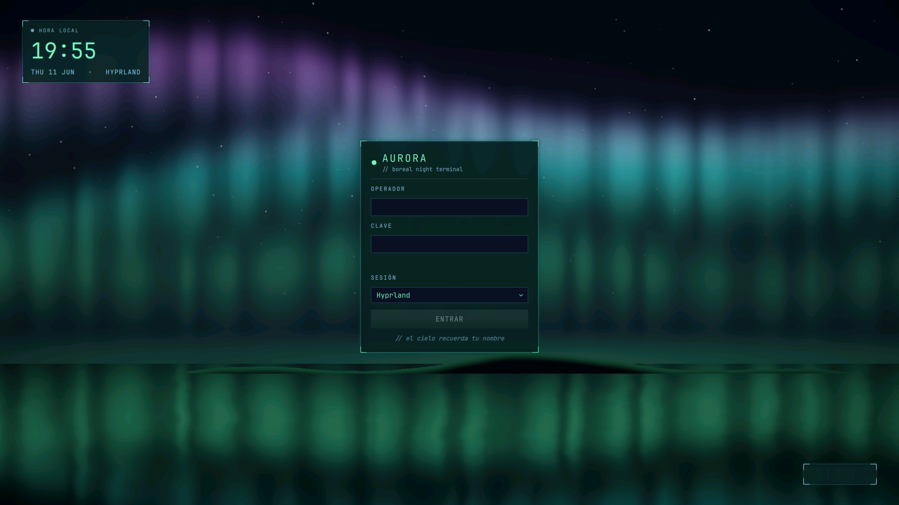

# Aurora — Tema SDDM (aurora boreal en tiempo real) para Arch + Hyprland

Pantalla de login con una **aurora boreal renderizada en vivo con un *fragment
shader* GLSL**: cortinas de luz verde→turquesa→violeta ondeando sobre un cielo
estrellado, una silueta de montañas y un **lago en calma que refleja el cielo**.
Noche ártica, quieta y etérea. Tema QML para **SDDM** (Qt5).



> Captura real del greeter (`sddm-greeter --test-mode`). Para regenerarla:
> `sddm-greeter --test-mode --theme ./Aurora` y captura con `grim -o <salida>`.

← Volver al [índice de temas](https://github.com/SebasRaul2503/my-login-screen/tree/main) (rama `main`).

## Requisitos

```bash
sudo pacman -S ttf-jetbrains-mono-nerd
```

- `ttf-jetbrains-mono-nerd` → texto e íconos de la UI (JetBrainsMono Nerd Font Mono).
- **OpenGL funcional** en el greeter (cualquier driver Mesa/propietario sirve): el
  fondo es un *fragment shader*. SDDM/Qt5 ya lo usan; no instalas nada extra.

Sin fuentes CJK: todo el cielo es procedural (cortinas, estrellas, lago, montañas).

## Probar sin instalar (seguro, no toca el sistema)

```bash
sddm-greeter --test-mode --theme ~/tests/arch/login/Aurora
```
(`Ctrl+C` o cerrar la ventana para salir)

## Instalar

```bash
./install.sh
```
Copia `Aurora/` a `/usr/share/sddm/themes/` (pide `sudo`). **No** activa el tema.

## Activar (con red de seguridad)

1. Abre una **TTY de respaldo**: `Ctrl+Alt+F2`, inicia sesión en texto y déjala abierta.
   (Vuelves al escritorio con `Ctrl+Alt+F1` o tu VT gráfico.)
2. Activa el tema:
   ```bash
   sudo sed -i 's/^Current=.*/Current=Aurora/' /etc/sddm.conf.d/kde_settings.conf
   ```
3. Aplica reiniciando SDDM **desde la TTY de respaldo** (esto cierra la sesión gráfica):
   ```bash
   sudo systemctl restart sddm
   ```

## Revertir / desinstalar

Si algo sale mal, desde la TTY de respaldo:

```bash
./uninstall.sh        # vuelve a Candy y borra Aurora
sudo systemctl restart sddm
```

O solo cambiar el tema activo de vuelta:
```bash
sudo sed -i 's/^Current=Aurora/Current=Candy/' /etc/sddm.conf.d/kde_settings.conf
```

## Personalización rápida

Edita `Aurora/theme.conf` (o el instalado en `/usr/share/sddm/themes/Aurora/theme.conf`):

| Clave | Qué controla |
|---|---|
| `AuroraLow` | Color de la aurora cerca del horizonte (verde `#2dff8c`) |
| `AuroraMid` | Color intermedio (turquesa `#19e6f0`) |
| `AuroraHigh` | Color en altura (violeta `#9b4dff`) |
| `AuroraSpeed` | Velocidad del ondeo de las cortinas |
| `StarDensity` | Densidad del campo de estrellas |
| `Accent` | Color principal de la UI (texto/botón, menta `#7af0c0`) |
| `Accent2` | Color secundario (cian): etiquetas, hairlines |
| `UIFont` | Fuente de la UI (Nerd Font para los íconos de power) |
| `HourFormat` / `DateFormat` | Formato de hora (24h) y fecha |
| `SessionLabel` | Etiqueta junto a la fecha (`HYPRLAND`) |
| `Wordmark` / `Tagline` | Título y subtítulo del panel de acceso |
| `Footer` | Línea easter-egg bajo el botón |
| `LoginLabel` | Texto del botón de acceso (`ENTRAR`) |

> La física del cielo (cortinas, reflejo del lago, montañas, estrellas) vive en
> `Aurora/Components/AuroraSky.qml`, dentro del *fragment shader* — todo procedural,
> sin imágenes.

## Estructura

```
Aurora/
├── metadata.desktop          # registro del tema
├── theme.conf                # parámetros configurables
├── Main.qml                  # raíz: cielo + cajas
└── Components/
    ├── AuroraSky.qml         # aurora boreal — fragment shader GLSL (Canvas-free)
    ├── CornerTicks.qml       # esquinas reutilizables del panel
    ├── TerminalInput.qml     # campo de texto
    ├── LoginForm.qml         # panel de acceso (auth SDDM)
    ├── ClockBox.qml          # reloj
    └── PowerBox.qml          # acciones de energía
```

Diseño y plan detallados en `docs/superpowers/`.
