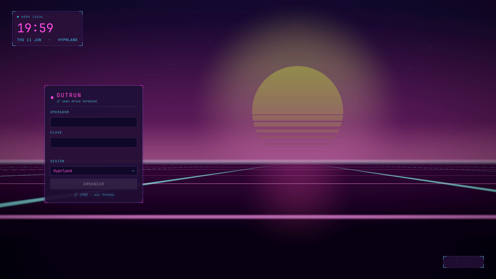

# Outrun — Tema SDDM (atardecer synthwave en tiempo real) para Arch + Hyprland

Pantalla de login **synthwave / outrun** renderizada en vivo con un *fragment
shader* GLSL: **sol retro con scanlines**, cielo índigo→magenta, y una **rejilla
de neón en perspectiva que corre hacia ti** con las vías cian convergiendo bajo el
sol. 1985, sin frenos. Tema QML para **SDDM** (Qt5).



> Captura real del greeter (`sddm-greeter --test-mode`). Para regenerarla:
> `sddm-greeter --test-mode --theme ./Outrun` y captura con `grim -o <salida>`.

← Volver al [índice de temas](https://github.com/SebasRaul2503/my-login-screen/tree/main) (rama `main`).

## Requisitos

```bash
sudo pacman -S ttf-jetbrains-mono-nerd
```

- `ttf-jetbrains-mono-nerd` → texto e íconos de la UI (JetBrainsMono Nerd Font Mono).
- **OpenGL funcional** en el greeter (cualquier driver Mesa/propietario sirve): el
  fondo es un *fragment shader*. SDDM/Qt5 ya lo usan; no instalas nada extra.

Sin fuentes CJK: el sol, la rejilla, las estrellas y el reflejo son procedurales.

## Probar sin instalar (seguro, no toca el sistema)

```bash
sddm-greeter --test-mode --theme ~/tests/arch/login/Outrun
```
(`Ctrl+C` o cerrar la ventana para salir)

## Instalar

```bash
./install.sh
```
Copia `Outrun/` a `/usr/share/sddm/themes/` (pide `sudo`). **No** activa el tema.

## Activar (con red de seguridad)

1. Abre una **TTY de respaldo**: `Ctrl+Alt+F2`, inicia sesión en texto y déjala abierta.
   (Vuelves al escritorio con `Ctrl+Alt+F1` o tu VT gráfico.)
2. Activa el tema:
   ```bash
   sudo sed -i 's/^Current=.*/Current=Outrun/' /etc/sddm.conf.d/kde_settings.conf
   ```
3. Aplica reiniciando SDDM **desde la TTY de respaldo** (esto cierra la sesión gráfica):
   ```bash
   sudo systemctl restart sddm
   ```

## Revertir / desinstalar

Si algo sale mal, desde la TTY de respaldo:

```bash
./uninstall.sh        # vuelve a Candy y borra Outrun
sudo systemctl restart sddm
```

O solo cambiar el tema activo de vuelta:
```bash
sudo sed -i 's/^Current=Outrun/Current=Candy/' /etc/sddm.conf.d/kde_settings.conf
```

## Personalización rápida

Edita `Outrun/theme.conf` (o el instalado en `/usr/share/sddm/themes/Outrun/theme.conf`):

| Clave | Qué controla |
|---|---|
| `Accent` | Magenta de neón / UI principal (`#ff4fd8`) |
| `Accent2` | Cian de neón: vías de la rejilla, etiquetas (`#41f0ff`) |
| `SunTop` | Color superior del sol (amarillo `#ffe24a`) |
| `SunBot` | Color inferior del sol (rosa `#ff2e8e`) |
| `GridSpeed` | Velocidad a la que la rejilla corre hacia ti |
| `UIFont` | Fuente de la UI (Nerd Font para los íconos de power) |
| `HourFormat` / `DateFormat` | Formato de hora (24h) y fecha |
| `SessionLabel` | Etiqueta junto a la fecha (`HYPRLAND`) |
| `Wordmark` / `Tagline` | Título y subtítulo del panel de acceso |
| `Footer` | Línea easter-egg bajo el botón |
| `LoginLabel` | Texto del botón de acceso (`ARRANCAR`) |

> La escena (sol con scanlines, rejilla en perspectiva, reflejo, estrellas) vive en
> `Outrun/Components/Synthwave.qml`, dentro del *fragment shader* — todo procedural,
> sin imágenes.

## Estructura

```
Outrun/
├── metadata.desktop          # registro del tema
├── theme.conf                # parámetros configurables
├── Main.qml                  # raíz: escena + cajas
└── Components/
    ├── Synthwave.qml         # atardecer outrun — fragment shader GLSL (Canvas-free)
    ├── CornerTicks.qml       # esquinas reutilizables del panel
    ├── TerminalInput.qml     # campo de texto
    ├── LoginForm.qml         # panel de acceso (auth SDDM)
    ├── ClockBox.qml          # reloj
    └── PowerBox.qml          # acciones de energía
```

Diseño y plan detallados en `docs/superpowers/`.
