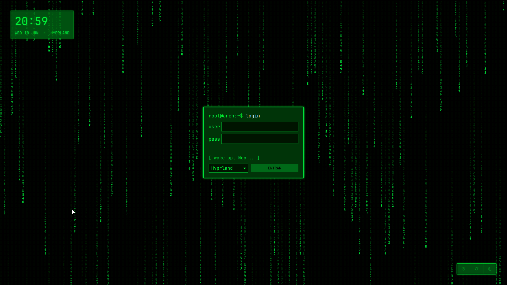
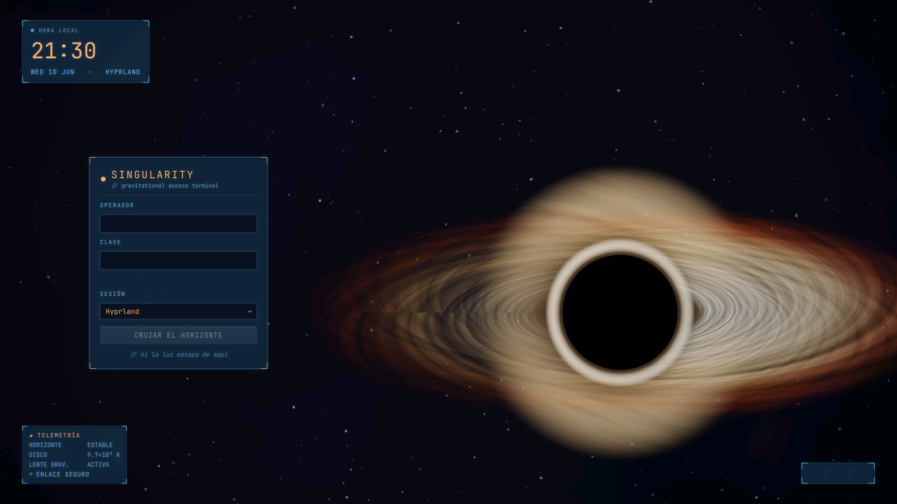

# my-login-screen — Temas de login SDDM para Arch + Hyprland

Colección de **temas SDDM** hechos a mano en QML. Cada tema vive en **su propia
rama** para mantenerlos aislados entre sí; esta rama `main` es solo el **índice**
que te lleva al tema correcto.

> 👉 Elige un tema en la tabla y cambia a su rama. `main` no contiene ningún tema
> instalable: solo este índice y la documentación de diseño en `docs/superpowers/`.

## Temas disponibles

| Tema | Vista previa | Rama | Estado |
|---|---|---|---|
| **MatrixRain** — lluvia de katakana verde sobre negro, cajas estilo terminal con glow | [](https://github.com/SebasRaul2503/my-login-screen/tree/feat/matrixrain-theme) | [`feat/matrixrain-theme`](https://github.com/SebasRaul2503/my-login-screen/tree/feat/matrixrain-theme) | ✅ funcional |
| **Singularity** — agujero negro gravitacional en tiempo real (fragment shader GLSL) + consola HUD | [](https://github.com/SebasRaul2503/my-login-screen/tree/feat/singularity-theme) | [`feat/singularity-theme`](https://github.com/SebasRaul2503/my-login-screen/tree/feat/singularity-theme) | ✅ funcional |

## Convención: todos los temas comparten la misma estructura

**Regla del repo:** cada tema sigue *exactamente* la misma estructura de archivos
que el tema de referencia (**MatrixRain**) y expone *exactamente* los mismos pasos
de instalación. Lo único que cambia entre temas es el **nombre del tema** y el
contenido visual de los `.qml`. Esto hace que aprender a instalar un tema sirva
para instalar todos.

Sustituye `<Tema>` por el nombre del tema (p. ej. `MatrixRain`) en todo lo que sigue.

### Estructura obligatoria de cada rama de tema

```
<rama feat/<tema>-theme>
├── README.md                       # mismo guion de secciones (ver abajo)
├── install.sh                      # copia <Tema>/ a /usr/share/sddm/themes/ (NO activa)
├── uninstall.sh                    # revierte al fallback y borra <Tema>/
├── docs/
│   ├── screenshots/<tema>.png      # captura real del greeter
│   └── superpowers/                # specs y planes (compartidos desde main)
└── <Tema>/
    ├── metadata.desktop            # registro del tema en SDDM
    ├── theme.conf                  # parámetros configurables
    ├── Main.qml                    # raíz: fondo + cajas
    └── Components/
        └── *.qml                   # componentes (rain, login, reloj, power, inputs…)
```

El `README.md` de cada tema sigue **siempre las mismas secciones, en este orden**:
`Requisitos` → `Probar sin instalar` → `Instalar` → `Activar (con red de
seguridad)` → `Revertir / desinstalar` → `Personalización rápida` → `Estructura`.

### Pasos de instalación — idénticos para cualquier tema

Estos pasos no cambian entre temas; solo cambia `<Tema>`. Son los mismos que
implementan `install.sh` / `uninstall.sh` de cada rama.

```bash
# 0. Clonar y cambiar a la rama del tema
git clone https://github.com/SebasRaul2503/my-login-screen.git
cd my-login-screen
git switch feat/<tema>-theme

# 1. Requisitos: instalar las fuentes/paquetes que liste el README del tema
#    (varían por tema; el resto de pasos no)

# 2. Probar sin instalar (seguro, no toca el sistema)
sddm-greeter --test-mode --theme ./<Tema>      # Ctrl+C para salir

# 3. Instalar (copia <Tema>/ a /usr/share/sddm/themes/, NO activa)
./install.sh

# 4. Activar — SIEMPRE con una TTY de respaldo abierta (Ctrl+Alt+F2)
sudo sed -i 's/^Current=.*/Current=<Tema>/' /etc/sddm.conf.d/kde_settings.conf
sudo systemctl restart sddm                    # ejecútalo desde la TTY de respaldo

# 5. Revertir / desinstalar (desde la TTY de respaldo si algo falla)
./uninstall.sh                                 # vuelve al fallback y borra <Tema>/
sudo systemctl restart sddm
```

> **Red de seguridad (igual para todo tema):** activa siempre con una TTY de
> respaldo abierta (`Ctrl+Alt+F2`, inicia sesión en texto y déjala abierta). Así,
> si el tema falla, puedes ejecutar `./uninstall.sh` sin quedarte sin login.
> El detalle exacto (fallback, comandos de revertir) está en el README de cada tema.

## Añadir un tema nuevo

Para que el repo se mantenga consistente, todo tema nuevo respeta la convención de
arriba:

1. Parte de `main` y crea una rama `feat/<tema>-theme`.
2. Crea el directorio `<Tema>/` con la **misma estructura obligatoria**
   (`metadata.desktop`, `theme.conf`, `Main.qml`, `Components/*.qml`).
3. Copia `install.sh` / `uninstall.sh` del tema de referencia y cambia solo el
   nombre del tema (y el fallback si aplica). **No** cambies los pasos.
4. Escribe `README.md` con **las mismas secciones en el mismo orden** y añade una
   captura real en `docs/screenshots/<tema>.png`.
5. Vuelve a `main` y agrega una fila a la tabla de [Temas disponibles](#temas-disponibles)
   apuntando a la rama.

## Documentación de diseño

Specs y planes detallados (compartidos por todas las ramas) en
[`docs/superpowers/`](docs/superpowers/).
